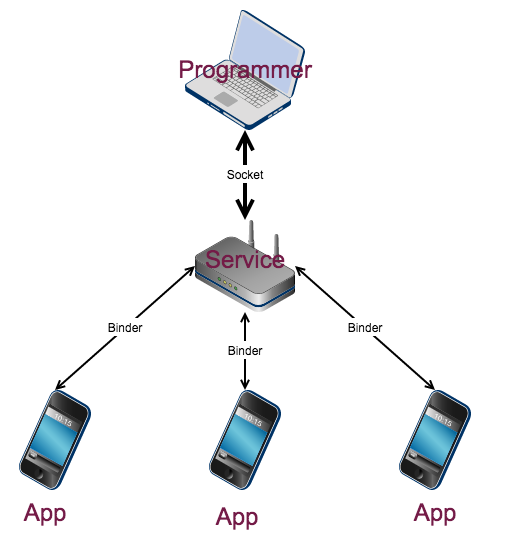
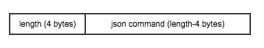
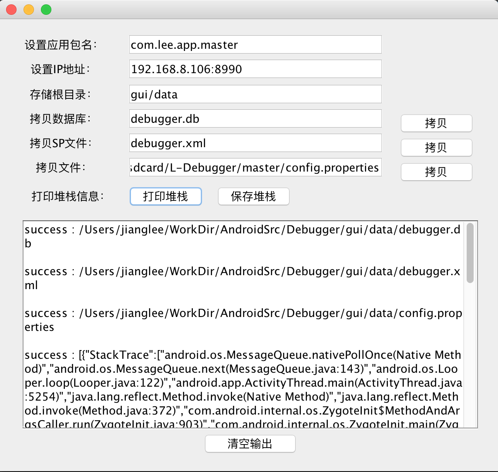

Debuggger
---
Debugger是一款Android辅助调试工具。  
作为Android开发者，在调试应用或修复Bug时，往往需要查看应用数据库、sp文件、线程状态、内存状态等等。当然，对于已经Root的手机来说读取数据库或者sp文件还算较舒服，但是当手机无法Root或者没有Root条件时，这件事就比较烦了；而对于线程或内存状态来说，当应用是Debug版时毫无压力，但是如果线上Release版本出现问题了想要查看现场数据时，而需要的数据又没有预埋日志点，这种时候应该会有生无可恋的感觉吧。  
而Debugger目的就是为了解决这种困境，让你拥有随时控制各种手机下各种版本应用的魔力。

Features
---
- 拷贝应用数据库
- 拷贝应用Shared Preferences
- 拷贝应用私有目录下的任何文件
- 拷贝任何具备访问权限的文件
- 查看应用当前所有线程状态
- 调用静态方法或单例方法
- 支持功能扩展

*容我装个B：以上特性适用于任何手机、任何版本*

Where The Magic From
---
Debugger采用Client-Server模式来设计整个通信过程，并在不同通信实体之间采用了不同的通信协议，原理如下所示：  



原理上其实就这么点货，剩下的基本就是实现的问题了（捂脸~逃）。为了锻炼自己的码字能力，我做了一个艰难的决定（其实我的内心是拒绝的），我决定描述一下我是怎么实现的：

1. Service部分  
Service是整个Debugger工具的核心，充当了Server的角色，包含Socket Server及Android Service两部分，分别用于与Programmer及App进行通信。  
设计上，这个Service没有寄宿在用户应用（以下称Master应用）中，主要考虑是希望更好的控制Service的运行，避免不良分子利用该Service获取应用私有数据，同时为了保证Serive运行和连接的安全性，除了将Serive隔离在Debug应用以外，还在Master应用启动Service时对Debug应用的签名进行验证，相当于简化版的SSL证书认证。  
运行时，Service接受从Programmer的命令，然后将命令转发至App，App响应命令并生成response数据，然后回传给Server，Server再将数据传回至Programmer。

2. Programmer部分  
Programmer部分运行在开发机器上，通过Socket与Service中的Socket Server建立连接，然后采用约定的命令格式向Socket Server发送请求，如：拷贝数据库、拷贝文件等。数据格式如下：


3. App部分  
App通过ADIL实现与Service的通信，首先通过`bindService`获取Service的代理Binder，然后通过该代理Binder将Client Binder注册到Service中，于是Service便可以通过注册的代理Client Binder向App发送命令并获取响应数据。

其实，Debugger更多是为了实践Socket及Binder，233333~~~

How To Use
---
假设存在Master及Debug两个应用：Master对应于你的产品应用，Debug用于寄宿Debugger进程。 
 
**Debug应用**  

- 依赖

```
	compile project(':sdk')
```
- 集成(可选)

```java
	Intent intent = new Intent(DebugApp.this, DebuggerService.class);
	startService(intent);
```
- 混淆

```java
	-dontwarn com.alibaba.fastjson.**
	-keep class com.alibaba.fastjson.** { *; }
```

**Master应用**

- 依赖

```
	compile project(':sdk')
```
- 集成

```java
	DebuggerUtil.getInstance()
		.bind(sInstance, new Client(sInstance), "com.lee.app.debug");
```
- 混淆

```java
	-dontwarn com.alibaba.fastjson.**
	-keep class com.alibaba.fastjson.** { *; }
	
	-keep class com.lee.sdk.framework.Client {
		@com.lee.sdk.framework.Command *;
	}
```

当Master与Debug均运行起来后，则可以启动工程中的gui，尝试获取Master的相关数据
**GUI**

- 配置文件config.properties

```java
	packageName=com.lee.app.master
	host=192.168.8.106:8990
	rootDir=gui/data
	defaultDbName=debugger.db
	defaultSpName=debugger.xml
	defaultFileName=/sdcard/L-Debugger/master/config.properties
```

- 界面

*上图中获取了Master应用的数据库文件、sp文件以及打印了当前的线程状态*

Todo
---
- 界面中集成静态方法及单例方法调用
- 提供普通实例注册接口，然后通过类似于静态方法调用的机制获取实例内存状态

License
---
[Apache License 2.0](https://opensource.org/licenses/Apache-2.0)